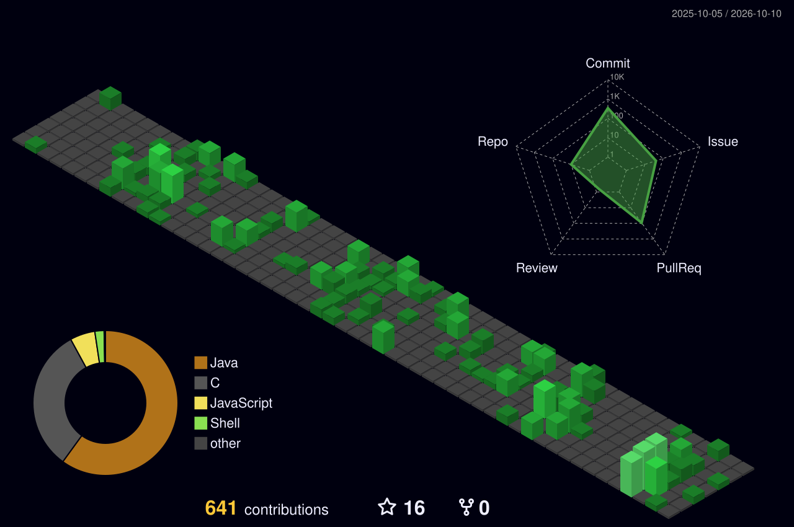

# AFaria20s

`404` · Computer Engineering Student @ UNIPVC

### About

- Computer engineering at IPVC, Portugal - software engineering, AI, statistics, systems programming
- OOP, Low-level and Linux enthusiast, terminal-first... always...
- Latest projects:

**LostOS**, a bare-metal x86 OS written from scratch in C

**TeamSync**, Cycling teams management, Java Spring Boot, JWT Security, Supabase, Render

### Stats

